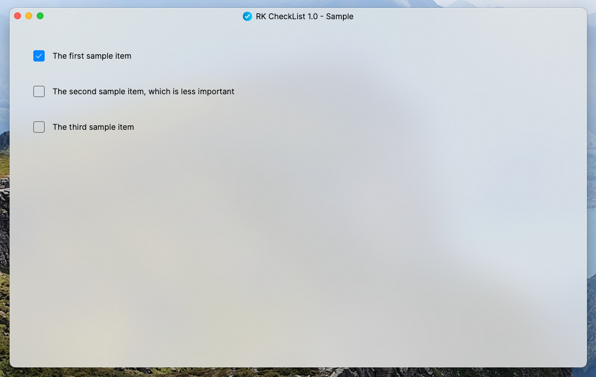
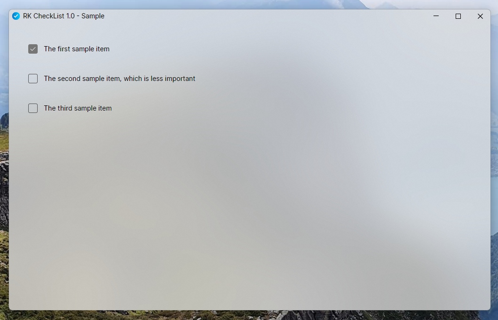

# RK CheckList
RK CheckList is simple checklist application for macOS and Windows. 
It serves as an example for building cross-platform applications with Avalonia and C#.

RK CheckList implements two use cases:
 - Open an existing *.rkCheckList file, view it and let user check items
 - Open the application and then load a *.rkCheckList file. Then view it, let user check items

There is no save functionality at all

*.rkCheckList files are written in yaml format like:
```yaml
title: "Sample"
items:
  - text: "The first sample item"
  - text: "The second sample item, which is less important"
  - text: "The third sample item"
```

## Screenshots
### macOS


### Windows


## Project is based on...
RK CheckList is based on .NET 8 and meant to be cross-platform. 

The project is based on following technologies / projects:
 - [Avalonia](https://github.com/AvaloniaUI/Avalonia): Cross-platform, Xaml based UI framework
 - [CommunityToolkit.Mvvm](https://github.com/CommunityToolkit/dotnet): Framework for the popular Mvvm pattern
 - [RolandK.AvaloniaExtensions](https://github.com/RolandKoenig/RolandK.AvaloniaExtensions): Adds features like ViewServices, DependencyInjection and some Mvvm sugar
 - [RolandK.InProcessMessaging](https://github.com/RolandKoenig/RolandK.InProcessMessaging): A messenger implementation which sends / receives in process messages
 - [Svg.Skia](https://github.com/wieslawsoltes/Svg.Skia): SVG rendering library with good Avalonia integration
 - [xunit](https://github.com/xunit/xunit): Popular unit testing library
 - [YamlDotNet](https://github.com/aaubry/YamlDotNet): A .NET library for YAML providing a serializer and deserializer